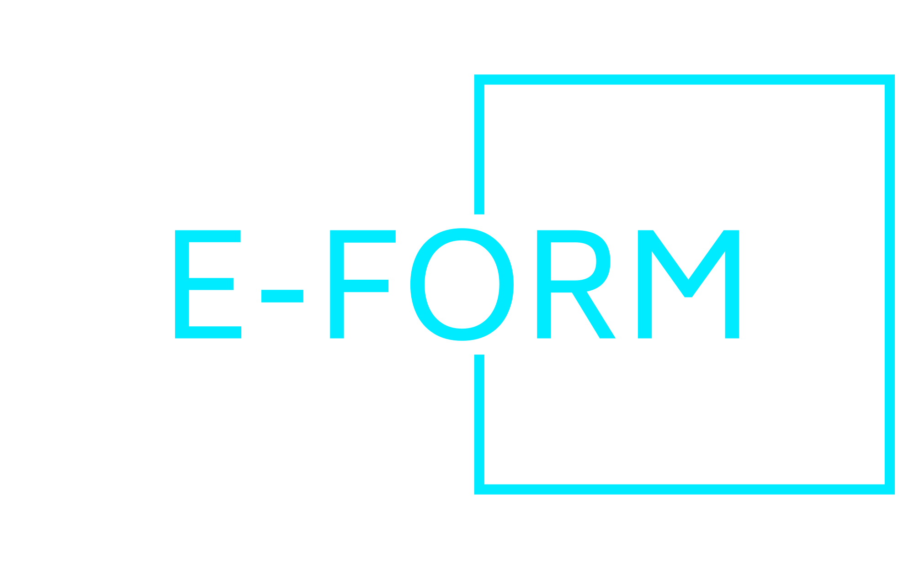
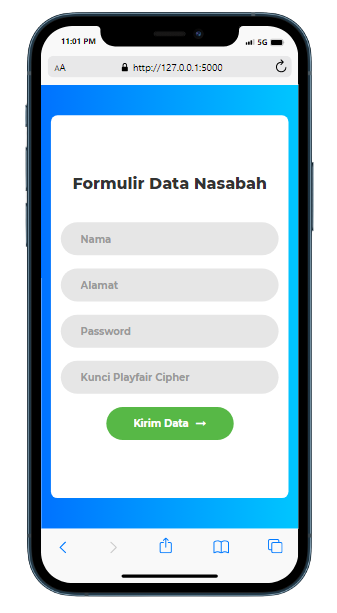
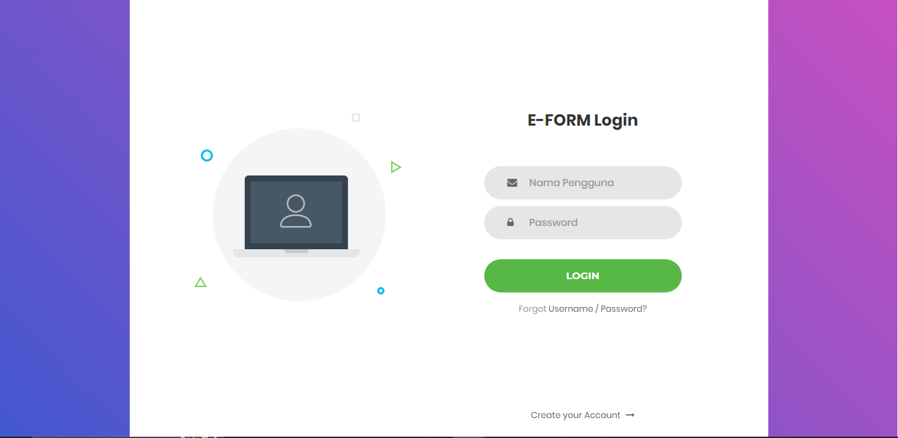
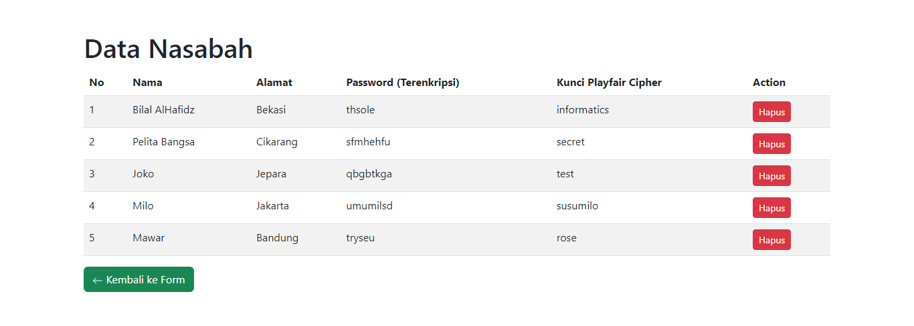

# UTS Kriptografi
## Profil
| #               | Biodata           |
| --------------- | ----------------- |
| **Nama**        | Bilal AlHafidz    |
| **NIM**         | 312110397         |
| **Kelas**       | TI.21.A.1         |
| **Mata Kuliah** | Kriptografi       |

---

# E-FORM - Aplikasi Web Sederhana untuk Login dan Entri Data Nasabah dengan Enkripsi Playfair Cipher

<div align="center">

</div>

E-FORM adalah aplikasi web yang memungkinkan pengguna untuk mengisi formulir, masuk, dan melihat data nasabah. Aplikasi ini mengenkripsi kata sandi pengguna menggunakan Playfair Cipher dan menyimpan data dalam database SQLite.

## Cara Program Bekerja

E-FORM terdiri dari aplikasi web Flask dan menggunakan Playfair Cipher untuk mengenkripsi kata sandi. Berikut adalah gambaran singkat tentang cara program ini bekerja:

1. **Inisialisasi**:
   - Aplikasi diinisialisasi menggunakan Flask.
   - Database SQLite dibuat atau dihubungkan, yang menyimpan data pelanggan.

2. **Antarmuka Pengguna**:
   - Pengguna dapat mengakses halaman-halaman berikut:
     - Halaman beranda (`/`): Menampilkan bilah navigasi dan formulir untuk memasukkan data pelanggan.
     - Halaman login (`/login`): Memungkinkan pengguna untuk login dengan menyediakan nama dan kata sandi.
     - Halaman data (`/data`): Menampilkan tabel data pelanggan.
     - Halaman profil (`/profile`): Menampilkan informasi pengguna setelah login yang sukses.

3. **Entri Data dan Enkripsi**:
   - Pengguna mengisi formulir dengan nama, alamat, kata sandi, dan kunci Playfair Cipher.
   - Kata sandi dienkripsi menggunakan Playfair Cipher dan disimpan dalam database.

4. **Login dan Autentikasi**:
   - Pengguna dapat login dengan menyediakan nama dan kata sandi.
   - Program memeriksa kredensial yang dimasukkan terhadap database.
   - Jika kredensial valid, pengguna diarahkan ke halaman profil mereka.

5. **Melihat Data**:
   - Pengguna dapat melihat data pelanggan pada halaman data.
   - Hal ini menampilkan nama pelanggan, alamat, kata sandi terenkripsi, dan kunci Playfair Cipher.

6. **Logout**:
   - Pengguna dapat logout, yang menghapus informasi sesi.

## Menjalankan Aplikasi

Untuk menjalankan aplikasi E-FORM, ikuti langkah-langkah berikut:

1. Pastikan Anda telah menginstal Flask. Jika belum, Anda dapat menginstalnya dengan perintah `pip install flask`.

2. Jalankan skrip `app.py`:
   ```
   python app.py
   ```

3. Buka browser web dan arahkan ke `http://localhost:5000` untuk mengakses aplikasi.

## Output

  - Halaman Form Input
  
  

  

  - Halaman Login
  
  

  - Halaman Tabel Data
  
  

## Lisensi

Proyek ini bersifat open-source dan tersedia di bawah [Lisensi MIT](LICENSE).

## Penulis

[Kyuurazz]

Jika Anda ingin melakukan perbaikan atau kontribusi lebih lanjut terhadap proyek ini, jangan ragu untuk fork dan buat permintaan tarik (pull request).

### Terima Kasih!

---